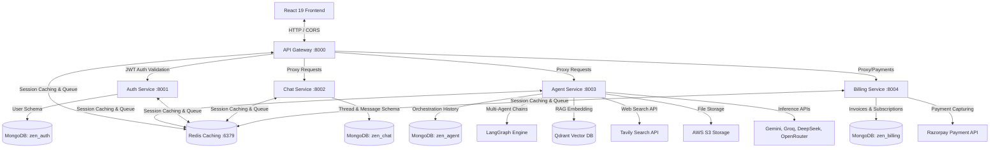

# 🧠 Zen AI - Enterprise Multi-Agent Orchestration Platform

[](https://microservices.io/)
[](https://nodejs.org/)
[](https://www.mongodb.com/)
[](https://js.langchain.com/docs/introduction/)
[](https://qdrant.tech/)

Zen AI is an enterprise-grade multi-agent orchestration platform designed for real-time AI capabilities, interactive code sandbox rendering (Claude-like Artifacts), dynamic payments, and secure user management. Built using a decoupled, highly-scalable **microservices architecture** on **Node.js (ESM)**, the system manages distinct workloads through specialized backend services routed via a central API Gateway, backed by a fast **React 19** frontend client.

---

## 📋 Table of Contents

1. [System Architecture](#-system-architecture)
2. [Microservices Breakdown](#-microservices-breakdown)
3. [Tech Stack](#-tech-stack)
4. [Monorepo Directory Layout](#-monorepo-directory-layout)
5. [Prerequisites](#-prerequisites)
6. [Environment Configuration](#-environment-configuration)
7. [Local Setup & Getting Started](#-local-setup--getting-started)
8. [Production Deployment](#-production-deployment)

---

## 🏛️ System Architecture

Zen AI uses a hub-and-spoke API gateway design to distribute requests cleanly. All client interactions hit the Gateway, which manages authentication validation and proxies traffic to the target microservices.



---

## 📦 Microservices Breakdown

### 1. [API Gateway](file:///e:/01%20Major%20Project/Multi_agent/zen-ai/backend/gateway) (`port 8000`)
- Single entrypoint for the client application.
- Integrates `helmet`, `morgan` and standard rate limiters.
- Resolves Firebase user authorization headers through standard middleware before forwarding requests.
- Proxies `/api/auth`, `/api/chat`, `/api/agent`, and `/api/billing` to the appropriate downstream service.

### 2. [Authentication Service](file:///e:/01%20Major%20Project/Multi_agent/zen-ai/backend/services/auth) (`port 8001`)
- Connects securely with Firebase Admin SDK to perform server-side verification of user tokens.
- Manages local user database sync in MongoDB (`zen_auth`).
- Returns session details and manages user profile modifications.

### 3. [Chat Service](file:///e:/01%20Major%20Project/Multi_agent/zen-ai/backend/services/chat) (`port 8002`)
- Manages discussion rooms, thread creations, thread deletions, and query histories.
- Implements MongoDB database (`zen_chat`) to persist conversation indices.

### 4. [Agent Orchestration Service](file:///e:/01%20Major%20Project/Multi_agent/zen-ai/backend/services/agent) (`port 8003`)
- Built using **LangChain** and **LangGraph** for multi-agent workflows.
- Handles document uploads, PDF parsing, PPTX parsing, and generates structured document formats (PDFKit).
- Integrates **Qdrant Vector Database** for Retrieval-Augmented Generation (RAG).
- Queries Tavily Web Search API to allow agents to search the web in real-time.
- Calls inference engines: Google Gemini, Groq (Llama models), DeepSeek, and OpenRouter.

### 5. [Billing & Subscriptions Service](file:///e:/01%20Major%20Project/Multi_agent/zen-ai/backend/services/billing) (`port 8004`)
- Implements subscription plans (Free vs. Premium).
- Integrates **Razorpay Node SDK** to generate orders and verify cryptographic signatures from payment webhooks.
- Persists transaction records in MongoDB (`zen_billing`).

---

## 🛠️ Tech Stack

### Core Platform
- **Runtime**: Node.js (v18+)
- **HTTP Server**: Express.js
- **Database / Cache**: MongoDB (Mongoose ODM) & Redis (ioredis client)
- **Containerization**: Docker & Docker Compose

### Orchestration & AI
- **Framework**: LangChain (`@langchain/core`) & LangGraph (`@langchain/langgraph`)
- **Web Search**: Tavily Search SDK
- **File Parsing**: AWS S3 SDK, Multer, PDF-Parse, PPTXGenJS, PDFKit
- **Vector Search**: Qdrant Vector DB

### Client App
- **UI Stack**: React 19, Vite 8, Tailwind CSS v4, Redux Toolkit, Framer Motion, Monaco Editor.

---

## 📂 Monorepo Directory Layout

```bash
zen-ai/
├── backend/
│   ├── gateway/                 # API Gateway router (Node.js/Express)
│   ├── services/
│   │   ├── agent/               # LangGraph multi-agent LLM worker
│   │   ├── auth/                # Firebase user sync & JWT authentication
│   │   ├── billing/             # Razorpay payment operations
│   │   └── chat/                # Discussion log store & metadata manager
│   ├── shared/
│   │   └── redis/               # Shared client connection for Redis caching
│   ├── docker-compose.yml       # Local development services configurations
│   └── package.json             # Root backend manifest
├── frontend/                    # React 19 / Vite client SPA
├── run-project.js               # Concurrency script to run all modules
└── package.json                 # Monorepo configuration
```

---

## 📋 Prerequisites

Before running this application, ensure you have:
1. **Node.js** (v18.x or above) installed.
2. **Docker Desktop** installed (used to spin up Redis).
3. A **MongoDB Atlas** cluster URL or a local MongoDB database.
4. A **Firebase Project** with Authentication enabled (you will need the config details and a Service Account key).
5. **API Keys** for:
   - Google Gemini API (Google AI Studio)
   - Groq API (Optional)
   - OpenRouter API (Optional)
   - Tavily API
   - AWS S3 (Bucket, Access Key, Secret)
   - Razorpay Sandbox account

---

## 🔑 Environment Configuration

Create `.env` configuration files inside each service directory. Reference the tables below:

### 1. API Gateway Configuration (`backend/gateway/.env`)
```env
PORT=8000
REDIS_URL="redis://localhost:6379"
AUTH_SERVICE="http://localhost:8001"
CHAT_SERVICE="http://localhost:8002"
AGENT_SERVICE="http://localhost:8003"
BILLING_SERVICE="http://localhost:8004"
```

### 2. Authentication Service Configuration (`backend/services/auth/.env`)
```env
PORT=8001
MONGODB_URL="mongodb+srv://<user>:<password>@cluster0.mongodb.net/zen_auth"
FRONTEND_URL="http://localhost:5173"
```
> **Note**: Place your Firebase Service Account private key JSON inside `backend/services/auth/` as `serviceAccount.json`.

### 3. Chat Service Configuration (`backend/services/chat/.env`)
```env
PORT=8002
MONGODB_URL="mongodb+srv://<user>:<password>@cluster0.mongodb.net/zen_chat"
```

### 4. Agent Service Configuration (`backend/services/agent/.env`)
```env
PORT=8003
MONGODB_URL="mongodb+srv://<user>:<password>@cluster0.mongodb.net/zen_agent"
GOOGLE_API_KEY="your_gemini_api_key"
GROQ_API_KEY="your_groq_api_key"
OPENROUTER_API_KEY="your_openrouter_api_key"
TAVILY_API_KEY="your_tavily_search_api_key"
GATEWAY_URL="http://localhost:8000"
AWS_ACCESS_KEY_ID="your_aws_key_id"
AWS_SECRET_ACCESS_KEY="your_aws_secret"
AWS_REGION="ap-south-1"
AWS_BUCKET_NAME="your_s3_bucket_name"
QDRANT_URL="your_qdrant_url"
QDRANT_API_KEY="your_qdrant_api_key"
```

### 5. Billing Service Configuration (`backend/services/billing/.env`)
```env
PORT=8004
MONGODB_URL="mongodb+srv://<user>:<password>@cluster0.mongodb.net/zen_billing"
AUTH_SERVICE="http://localhost:8001"
RAZORPAY_KEY_ID="rzp_test_your_razorpay_key"
RAZORPAY_KEY_SECRET="your_razorpay_secret"
```

### 6. Frontend Client Configuration (`frontend/.env`)
```env
VITE_FIREBASE_API_KEY="your_firebase_web_client_key"
VITE_SERVER_URL="http://localhost:8000"
VITE_RAZORPAY_KEY="rzp_test_your_razorpay_key"
```

---

## 🚀 Local Setup & Getting Started

Follow these steps to run the complete environment locally:

### Step 1: Start Redis
Use Docker to boot up the caching server defined in `backend/docker-compose.yml`:
```bash
cd backend
docker-compose up -d
```
This spins up Redis running at `localhost:6379`.

### Step 2: Install Monorepo Dependencies
From the project root directory, run a script to install node packages across the backend services and the frontend client:
```bash
# Install root package configuration if any
npm install

# Build Node modules inside each folder
cd backend/gateway && npm install
cd ../services/auth && npm install
cd ../chat && npm install
cd ../agent && npm install
cd ../billing && npm install
cd ../../../frontend && npm install
```

### Step 3: Run the Complete System
Zen AI is equipped with a concurrent runner script [run-project.js](file:///e:/01%20Major%20Project/Multi_agent/zen-ai/run-project.js) located at the root of the project. Run it to launch all services together:
```bash
cd ..
node run-project.js
```
The runner will print color-coded logs for each service in the terminal console:
- `[gateway]` in Green
- `[auth]` in Magenta
- `[chat]` in Yellow
- `[agent]` in Blue
- `[billing]` in Red
- `[frontend]` in Cyan

Access the application in your web browser at **[http://localhost:5173](http://localhost:5173)**.

---

## 🐳 Production Deployment

### Dockerizing Individual Services
Each microservice contains its own standalone `Dockerfile` (e.g., [Dockerfile](file:///e:/01%20Major%20Project/Multi_agent/zen-ai/backend/gateway/Dockerfile)). To containerize a microservice:
```bash
cd backend/services/chat
docker build -t zen-chat-service:1.0.0 .
```

### Environment Best Practices
- **Kubernetes / ECS**: Deploy each service container behind a network load balancer, keeping the API gateway exposed publicly while keeping the downstream services in a private subnet.
- **Secret Management**: Pass MongoDB connection strings and API keys using AWS Secrets Manager, HashiCorp Vault, or encrypted container environmental parameters.
- **Frontend CDN**: Build the frontend assets via `npm run build` and host the resulting static `dist/` directory on Vercel, Netlify, or AWS S3 paired with CloudFront.

